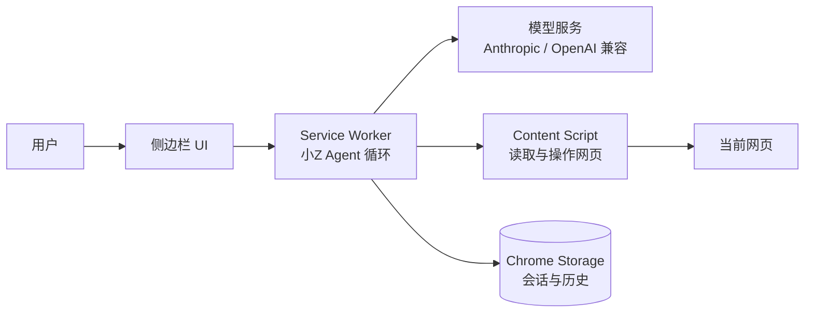

<p align="center">
  
</p>

<h1 align="center">Page Agent · 小Z</h1>

<p align="center">
  一个住在浏览器侧边栏里的私人 AI 助手<br>
  能聊天、读网页，也能在你的确认下操作网页
</p>

<p align="center">
  <a href="https://github.com/DoTrungHuy/chrome-page-agent/releases"></a>
  <a href="https://github.com/DoTrungHuy/chrome-page-agent/blob/main/LICENSE"></a>
  <!--
  -->
</p>

> **当前状态：预览版。** 适合个人使用和小范围试用。使用前请阅读下面的安全说明，尤其是 API Key、页面内容和自动操作部分。

## ✨ 它能做什么

- **通用聊天**：解释概念、写代码、翻译、算数、整理思路或闲聊。
- **读懂当前网页**：把页面整理成带 `[ref=N]` 编号的结构化快照，模型可以准确指认按钮、输入框和链接。
- **操作网页**：点击、输入、滚动、等待和导航，适合搜索、填写表单、浏览结果等重复任务。
- **多模型接入**：支持 Anthropic Messages API 和 OpenAI 兼容 API，可配置多个账号和模型。
- **流式交互**：边生成边显示，工具调用过程可见，随时可以停止。
- **小Z人格**：用户用什么语言提问，小Z就用什么语言回答；不明确时可以向用户追问。

## 🚀 快速开始

### 1. 安装扩展

需要 **Chrome 116 或更高版本**。

你可以选择以下任一种方式：

**方式 A：下载 Release ZIP**

1. 打开 [Releases](https://github.com/DoTrungHuy/chrome-page-agent/releases)。
2. 下载最新的 `page-agent-*.zip` 并解压到一个固定文件夹。
3. 打开 `chrome://extensions`。
4. 打开右上角的「开发者模式」。
5. 点击「加载未打包的扩展程序」，选择解压后的文件夹。

**方式 B：下载源码**

```bash
git clone https://github.com/DoTrungHuy/chrome-page-agent.git
```

然后在 `chrome://extensions` 中加载仓库根目录。这个项目没有构建步骤，源码目录本身就是可加载的扩展目录。

### 2. 配置模型

1. 点击浏览器工具栏中的 Page Agent 图标，打开侧边栏。
2. 点击右上角齿轮进入设置页。
3. 从「快捷预设」选择服务，或手动填写供应商、Base URL、模型名和 API Key。
4. 保存后回到侧边栏开始对话。

模型必须支持 **function calling / tool use**，否则只能聊天，不能操作网页。

### 3. 第一次使用

可以直接试试：

| 你可以说 | 小Z会做什么 |
|---|---|
| `这个页面在讲什么？` | 读取当前网页并总结重点 |
| `帮我在搜索框搜“机械键盘”` | 找到输入框、填入文字并提交 |
| `点开第一条结果，看看价格` | 读取页面、点击结果、再次读取页面 |
| `翻到页面底部` | 滚动到底部并观察页面变化 |
| `打开 github.com` | 在新标签页或浏览器内部页面上按要求导航 |

## 🎛️ 三种操作模式

输入框左下角可以切换模式，也可以按 `Shift+Tab` 循环切换。

| 模式 | 页面权限 | 适合场景 |
|---|---|---|
| **计划** | 只能 `read_page`、`scroll`、`wait`，不能点击、输入或跳转 | 先分析页面，再让你决定怎么做 |
| **自动**（默认） | 只读操作直接执行；疑似付款、删除、发送、提交等动作会请求确认 | 日常使用，兼顾效率和安全 |
| **放手跑** | 工具直接执行，不弹确认 | 你已经确认安全的重复任务 |

模式是执行侧的权限门禁，不只是写在提示词里的约定。计划模式不会把写操作工具发给模型；即使模型硬报未授权工具，执行侧也会拦截。

### 新标签页上的行为

新标签页、`about:blank` 或 `chrome://` 页面不能被注入读取。此时：

- 普通问题仍然可以直接回答，不会强迫你先打开网页。
- 小Z没有读取页面的工具。
- 只有当你明确要求打开网页时，才会使用导航工具。
- 如果你说得不明确，小Z应该先问清楚要打开哪个页面。

## 🔌 支持的模型服务

设置页的「快捷预设」会自动填入 Base URL 和一个模型名；模型名可以按服务当前可用型号自行修改。

| 服务 | 接口格式 | 默认 Base URL |
|---|---|---|
| Anthropic Claude | Anthropic Messages | `https://api.anthropic.com` |
| OpenAI | OpenAI 兼容 | `https://api.openai.com/v1` |
| DeepSeek | OpenAI 兼容 | `https://api.deepseek.com/v1` |
| Kimi / Moonshot | OpenAI 兼容 | `https://api.moonshot.cn/v1` |
| 通义千问 DashScope | OpenAI 兼容 | `https://dashscope.aliyuncs.com/compatible-mode/v1` |
| 智谱 GLM | OpenAI 兼容 | `https://open.bigmodel.cn/api/paas/v4` |
| OpenRouter | OpenAI 兼容 | `https://openrouter.ai/api/v1` |
| Gemini 兼容层 | OpenAI 兼容 | `https://generativelanguage.googleapis.com/v1beta/openai` |
| 本地 Ollama | OpenAI 兼容 | `http://localhost:11434/v1` |

> 如果切换到另一种接口格式，当前对话会提示先新建对话，避免 Anthropic 和 OpenAI 两套历史消息结构混用。相同接口格式内切换模型可以继续使用历史上下文。

想添加新的 OpenAI 兼容服务，通常只需要在 `lib/providers.js` 的 `PRESETS` 中添加一行；只有 wire format 完全不同的服务才需要新增适配器。

## 🛡️ 安全与隐私

这类扩展能看到网页，也能执行网页操作。请把下面几条当作使用前提：

- **API Key 不会写进仓库或 ZIP。** 设置页填写的 Key 保存在本机 Chrome 的 `chrome.storage.local` 中；对自己的电脑方便，但不是硬件安全存储。
- **页面内容会发送给你配置的模型服务。** 不要在不信任的服务上处理密码、身份证号、支付信息或其他敏感内容。
- **网页内容不是指令。** 页面正文会被明确包在内容边界中，提示词注入会被标记；但这不是绝对防护。
- **高风险页面请使用「计划」或「自动」模式。** 不要在付款、删除、发消息、改账号设置的页面上使用「放手跑」。
- **`<all_urls>` 权限较宽。** 它用于让扩展能够在任意普通网页注入；如果要申请 Chrome Web Store，需要在审核问卷中解释用途，或改造为 `activeTab` 授权方案。
- **不要把自己的 API Key 打包给别人。** 如果要公开分发，应该让每位用户填写自己的 Key，或提供自建后端代理。

## 🧭 工作原理



页面快照不是简单的 `innerText`：`content.js` 会过滤不可见元素，为可交互元素生成引用编号。例如：

```text
# 示例商城 - 搜索结果
url: https://shop.example.com/search?q=keyboard

heading1 "搜索结果：keyboard"
text "共找到 128 件商品"
[ref=1] searchbox "搜索商品" value="keyboard"
[ref=2] button "搜索"
[ref=3] link "机械键盘 87键" → /p/10023
  text "¥399.00"
[ref=4] button "加入购物车"
```

模型随后可以调用 `click({"ref":4})`。`ref` 只在对应的一次 `read_page` 快照中有效；页面跳转或内容变化后必须重新读取。

## 🧪 测试与打包

测试全程在本地运行，不访问真实模型服务：端到端测试会启动临时 Chrome、加载扩展，并在 localhost 上运行假的模型服务。

```bash
# 全部测试
npm test

# 只跑单元测试
npm run test:unit

# 只跑浏览器端到端测试
npm run test:e2e

# 按关键词筛选套件
node tests/run.mjs modes

# 需要完整输出时
node tests/run.mjs modes -v

# 生成可分发 ZIP
node pack.mjs
```

PowerShell 如果拦截了 `npm.ps1`，可以使用对应的 `npm.cmd` 命令。找不到 Chrome 时，设置 `CHROME_PATH` 指向 Chrome 可执行文件。

当前测试覆盖：

- 供应商 SSE 流解析、工具调用和历史回填
- Markdown 渲染与危险链接/HTML 注入
- 页面快照、可见性、可访问名称和 `ref` 操作
- Plan / Auto / Always 权限门禁与确认流程
- 多供应商历史会话保护
- Service Worker 回收后的会话恢复
- 新标签页导航、输入框事件和表单提交
- ZIP 结构、文件清单和扩展 manifest

## 📦 项目结构

```text
manifest.json      Chrome MV3 清单
background.js      Service Worker：小Z Agent、模型请求、会话与权限
content.js         页面注入：DOM 快照、点击、输入、滚动
lib/providers.js   供应商适配层
lib/tools.js       工具定义与页面工具派发
lib/sse.js         SSE 流解析
lib/markdown.js    安全 Markdown 渲染
sidepanel.*        侧边栏聊天界面
options.*          模型账号与参数设置页
icons/             扩展图标
tests/             单元测试与端到端测试
pack.mjs           生成干净 ZIP 的打包脚本
PLAN.md            设计与演进记录
```

## 🌐 浏览器兼容性

- **Chrome**：主要目标，要求 Chrome 116+。
- **Edge**：MV3 基本兼容，同一个 ZIP 可作为起点测试。
- **Firefox**：需要改造 `chrome.*`、Service Worker、侧边栏 API 和权限模型，当前不保证可用。

## ⚠️ 当前限制

- 不读取 iframe 内容；跨域 iframe 通常也无法访问。
- 不提供真正的视觉理解，canvas 或纯图片按钮识别有限。
- 无法在 `chrome://`、扩展页、Chrome 应用商店页面上注入读取脚本。
- 当前一次只围绕一个活动标签页工作，不能跨标签页协同。
- 模型服务的工具调用质量取决于具体模型；本地小模型可能需要调整模型或参数。

## 📤 发布与参与

项目当前通过 GitHub Release 分发预览版：

- [查看 Releases](https://github.com/DoTrungHuy/chrome-page-agent/releases)
- [查看源码](https://github.com/DoTrungHuy/chrome-page-agent)
- [提交 Issue](https://github.com/DoTrungHuy/chrome-page-agent/issues)

如果你发现页面快照错误、工具行为异常或某个模型接口不兼容，欢迎附上：浏览器版本、服务类型、错误信息和最小复现步骤。不要在 Issue 中粘贴 API Key、Cookie 或私人页面内容。

## 📄 License

[MIT](LICENSE)
